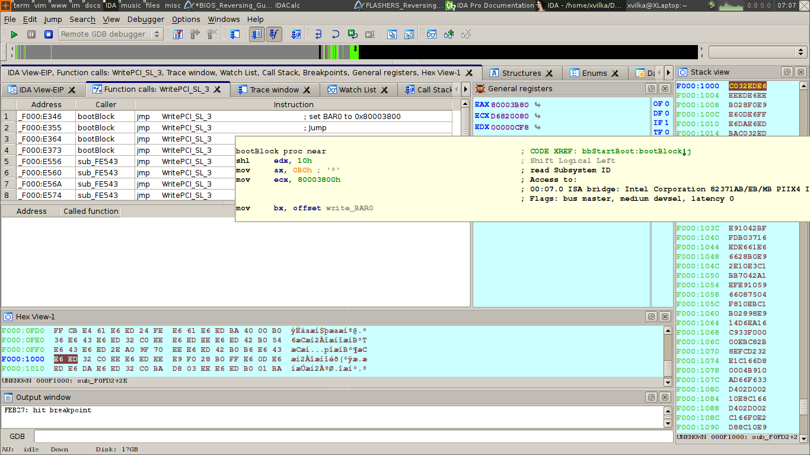

## Introduction

Currently, as of _September 2023_, Wikipedia lists **679 languages** in their [List of Programming Languages](https://en.wikipedia.org/wiki/List_of_programming_languages).

Within the overwhelming landscape of languages, [Assembly](https://en.wikipedia.org/wiki/Assembly_language) stands out as one of the most fundamental. It occupies a unique position, acting as a bridge between the abstract world of high-level languages and the raw binary of machine code.

It's a language that might seem arcane to some, but for those delving into the world of reverse engineering, it's an essential companion. It's a world where the programmer is in direct conversation with the computer's hardware, crafting instructions that are both explicit and powerful!

### What to expect from this article

As we journey through the intricacies of Assembly and its role in reverse engineering, readers can expect to:

- Gain a foundational understanding of Assembly language and its operation.
- Learn what role Assembly plays in reverse engineering.
- Understand the challenges and rewards of working with such a low-level language.

After reading this article, you will have a solid grasp of why Assembly is often dubbed the "heart" of reverse engineering and why, despite the rise of modern high-level languages, it remains a vital skill for many.

## What is Assembly Language?

Assembly language, often simply referred to as 'Assembly' or `ASM` for short, is a low-level programming language that is specific to a computer's architecture.

### The Bridge Between High-Level Languages and Machine Code

Imagine high-level languages as the spoken ones we use in our daily lives – rich, expressive, and abstract. They allow us to convey complex ideas without delving into the minutiae of how our thoughts are processed.

Machine code, on the other hand, is like the electrical impulses in our brain – direct, binary, and not meant for human interpretation.

Unlike high-level languages like `Python` or `Java`, which are designed for readability and abstraction, Assembly is much closer to machine code – the binary language that computers natively understand.

When a programmer writes in Assembly, they're essentially giving direct instructions to the computer's hardware, making it a powerful tool for those who truly want mastery over a machine's operation.

### Language Processing Flow

To understand the role of Assembly in reverse engineering, it's important to understand the flow of language processing in a computer.

At a high level, it looks something like this:

- **Source Code:** This is the code written by the programmer in a high-level language like `Go`, `Java`, or `C++`.
- **Preprocessor:** If the language has a preprocessor (like `C` or `C++`), it processes directives like `#include` and `#define` to include code from other files and replace macros.
- **Compiler:** The compiler translates the high-level source code into an intermediate form called assembly code. This code is specific to the computer's architecture, but is still human-readable.
- **Assembler:** The assembler translates the assembly code into machine code, which is a binary representation of the code that can be executed directly by the computer's CPU.
- **Linker:** If the program references functions or data from other files or libraries, the linker combines all these references into a single executable file.
- **Loader:** When you run the program, the loader loads the executable file into memory so that the CPU can execute it.
- **Execution:** The machine code is executed by the computer's CPU.

### The Role of an Assembler

An assembler is a specialised tool that plays a pivotal role in the world of Assembly language. Its function is to take the code written by programmers and _assemble_ it into machine code that can be executed by a computer's central processing unit (CPU).

Think of it as a translator, converting the structured, mnemonic instructions of Assembly into the binary language of 1s and 0s that a machine understands.

For instance, an Assembly instruction to load a value into a register might look like `MOV AX, 1`. The assembler would take this instruction and convert it into the corresponding binary code, which might look something like `10110000 00000001`.

This process of translation ensures that the programmer can work with a language that is more comprehensible than raw binary, while still producing code that runs with the efficiency and speed of machine code.

---

In understanding Assembly language, one appreciates the delicate balance it strikes – offering a glimpse into the machine's soul while still being accessible to human intellect.

It's this balance that makes Assembly both challenging and rewarding for those who persist despite the difficulty and attain fluency. That being said, there is still great value in having a basic familiarity with the low-level operation of our tools.

## The Role of Assembly in Reverse Engineering

Reverse engineering is the art and science of taking apart a product (often software) to understand how it works, either for replicating it, improving upon it, or identifying vulnerabilities.

In the context of software, this often means diving deep into its compiled code to decipher the original source or functionality.

Since most software is compiled down to machine code for execution, understanding that machine code is critical for reverse engineers.

### x86 and x64

`x86` refers to a family of instruction set architectures ([ISA's](https://en.wikipedia.org/wiki/Instruction_set_architecture)) that originated with the Intel 8086 microprocessor. Over time, the term “`x86`” has come to represent a broad set of `32-bit` microprocessors that share a common instruction set and architectural features.

`x64`, on the other hand, refers to a family of `64-bit` microprocessors that are compatible with the x86 instruction set. They're often referred to as `x86-64` or `AMD64`.

The reason these architectures are so important is that they're the most common architectures you'll find in modern systems.

## Key Components of Assembly Language

As we've established, Assembly language is inherently different from high-level languages, its components are more rudimentary, reflecting the basic operations that a computer can perform.

Let's delve into some of these essential components and understand their significance.

### Registers

Registers are one of the foundational elements of computer architecture. They're akin to small storage units where data can be stored, retrieved, and manipulated during program execution.

#### Function of Registers

A register is a small, fast storage location directly within the CPU. It can hold data, instructions, addresses, or any other kind of information that the CPU might need immediate access to.

Because of their location and size, registers allow for rapid data retrieval and manipulation, which makes them essential for efficient program execution.

#### Commonly Used Registers and Their Roles

Different computer architectures have different registers, and the names will vary depending on the size. For instance, in the x86 architecture, there are `8-bit`, `16-bit`, `32-bit`, and `64-bit` registers.

Below, I'll mostly be referring to the `32-bit` registers; however, it's good to be aware that the most significant bytes of the larger registers can be accessed by the smaller registers.

For example:

- `RAX` is the `64-bit` version of `EAX`
- `EAX` is the `32-bit` version of `AX`
- `AX` is the `16-bit` version of `EAX`
- `AL` is the `8-bit` version of `AX`

With that in mind, here are some of the common `32-bit` registers to be aware of:

- **`ESI`**: The Extended Source Index. It is used as a pointer to a source in stream operations like copying. It is also known as the Source Index (`SI`).
- **`EDI`**: The Extended Destination Index. It is used as a pointer to a destination in stream operations like copying. It is also known as the Destination Index (`DI`).
- **`EBP`**: The Extended Base Pointer. It is used to point to the base of the stack frame. It is also known as the Base Pointer (`BP`).
- **`ESP`**: The Extended Stack Pointer. It is used to point to the top of the stack frame. It is also known as the Stack Pointer (`SP`).
- **`IP`**: Instruction Pointer. It points to the next instruction to be executed. It's also known as the Program Counter (`PC`).
- **`EAX`**: The Extended Accumulator Register. `EAX` is primarily used in mathematical operations, and it is also used to store the return value of a function. It is also known as the Accumulator Register (`AX`).
- **`EBX`**: The Extended Base Register. It is often used as a pointer for data access. It is also used in multiplication and division operations. Furthermore, it is also known as the Base Register (`BX`).
- **`ECX`**: The Extended Counter Register. It is used in loop operations, where it acts as a counter for the number of iterations. It is also used in shift operations. Likewise, it is also known as the Counter Register (`CX`).
- **`EDX`**: The Extended Data Register. It is used in I/O operations and multiplication and division. It is also used to store the high-order bits of the result of multiplication and division. Not only that, but it is also known as the Data Register (`DX`).
- **`EIP`**: The Extended Instruction Pointer. It points to the next instruction to be executed in the program. It is also known as the Extended Program Counter (`EPC`).
- **`EFLAGS`**: The Extended Flags Register. It stores the flags and the system status.
- **`CS`, `DS`, `SS`, `ES`, `FS`, `GS`**: Segment Registers. They are used in memory segmentation.

### Instructions

Instructions are the heart of the Assembly language. They dictate the operations that the CPU should perform.

#### Understanding Common Assembly Instructions

- **`MOV`**: This instruction is used to move or copy data from one location to another. For example, `MOV AX, BX` would move the data from the `BX` register to the `AX` register.
- **`PUSH`**: This instruction pushes data onto the stack. For instance, `PUSH AX` would place the value in the AX register onto the top of the stack.
- **`POP`**: The opposite of `PUSH`, it pops data off the stack. `POP BX` would remove the top value from the stack and place it in the `BX` register.
- **`JMP`**: A jump instruction. It changes the flow of execution by making the Instruction Pointer jump to a different location. For example, `JMP LABEL1` would jump to the instruction labelled as `LABEL1`.
- **`NOP`**: A no-operation instruction. It does nothing and is often used as a placeholder.
- **`INT`**: An interrupt instruction. It interrupts the current program flow and executes a specific interrupt handler.
- **`CALL`**: A call instruction. It calls a function by pushing the current Instruction Pointer onto the stack and jumping to the function's location.
- **`RET`**: A return instruction. It returns from a function by popping the Instruction Pointer off the stack and jumping to that location.
- **`CMP`**: A comparison instruction. It compares two values and sets the flags accordingly.

#### The Role of Operands

Operands are the values or registers that an instruction operates on. For instance, in the instruction `MOV AX, 1`, `AX` and `1` are the operands.

The instruction specifies the operation, while the operands determine the data or locations involved in that operation.

### Flags

Flags are special registers that store the outcomes of certain operations, especially arithmetic ones. They play a pivotal role in decision-making and control-flow within Assembly programs.

#### The Purpose of Flags in Decision-making

After an operation, flags can be set, cleared, or left unchanged based on the result. These flags can then be checked to make decisions.

For instance, after a subtraction operation, if the result is zero, the `Zero` flag will be set. This can be checked to make decisions in the program.

#### Common Flags

- **Zero Flag (`ZF`)**: Set if the result of an operation is zero.
- **Carry Flag (`CF`)**: Set if an arithmetic operation results in a carry-out or borrow into the high-order bit.
- **Overflow Flag (`OF`)**: Set if an arithmetic operation results in a value that's too large to be represented in the destination operand.
- **Sign Flag (`SF`)**: Set if the result of an operation is negative.
- **Parity Flag (`PF`)**: Set if the result of an operation has an even number of 1s in its binary representation.
- **Auxiliary Carry Flag (`AF`)**: Set if an arithmetic operation results in a carry-out or borrow from bit 3 to bit 4.
- **Direction Flag (`DF`)**: Determines the direction of string operations.
- **Interrupt Flag (`IF`)**: Determines whether interrupts are enabled or disabled.
- **Trap Flag (`TF`)**: Determines whether the CPU should enter single-step mode.
- **Resume Flag (`RF`)**: Determines whether the CPU should resume execution after a debug exception.
- **Nested Task Flag (`NT`)**: Determines whether the current task is nested.
- **Virtual 8086 Mode Flag (`VM`)**: Determines whether the CPU is in virtual 8086 mode.
- **Alignment Check Flag (`AC`)**: Determines whether alignment checking is enabled or disabled.
- **Virtual Interrupt Flag (`VIP`)**: Determines whether virtual interrupts are enabled or disabled.
- **Virtual Interrupt Pending Flag (`VIF`)**: Determines whether virtual interrupts are pending.
- **Identification Flag (`ID`)**: Determines whether the CPU supports the CPUID instruction.

---

Understanding these components is important for anyone delving into Assembly language – they form the basic building blocks upon which all Assembly programs are constructed.

## Basic Assembly Syntax and Structure

Assembly language, while being low-level, still has a structure and syntax that programmers must adhere to. This structure varies slightly between different Assembly syntaxes, the most common of which are AT&T syntax and Intel syntax.

### AT&T vs Intel Syntax

AT&T and Intel syntax are two different ways of writing Assembly code. They differ in several ways, including operand order, immediate value representation, and register naming.

**Operand Order:** In Intel syntax, the destination operand is listed before the source operand. For example, `MOV AX, 10` in Intel syntax would move the value `10` into the `AX` register. In AT&T syntax, the source operand is listed before the destination operand, so the equivalent instruction would be `movl $10, %eax`.

**Immediate Value Representation:** In Intel syntax, immediate values are represented as they are. For example, 10 would be written as 10. In AT&T syntax, immediate values are prefixed with a `$`. So 10 would be written as `$10`.

**Register Naming:** In Intel syntax, registers are named as they are, like `AX` or `EBX`. In `AT&T` syntax, registers are prefixed with a `%`, like `%ax` or `%ebx`.

Understanding these differences is crucial when reading or writing Assembly code, as the same instruction can look very different.

### Comments, Directives, and Labels

Assembly language also includes **comments**, **directives**, and **labels**, which help to structure the code and make it more readable.

**Comments:** Comments in Assembly start with a semicolon (`;`). Anything after the semicolon on the same line is considered a comment and is ignored by the assembler. For example, `MOV AX, 10 ; Move 10 into AX`.

**Directives:** Directives are instructions to the assembler. They start with a period (`.`) and can be used to define data, set the origin, include other files, and more. For example, `.data` is a directive that tells the assembler that the following lines contain data definitions and `.org 0x100` is a directive that tells the assembler to set the origin to `0x100`.

**Labels:** Labels are used to mark specific points in the code. They can be used as targets for jump and call instructions, or to name data locations. For example, `LABEL1:` is a label that can be used as a target for a jump instruction.

## Tools of the Trade

When working with Assembly language, especially in the context of reverse engineering, there are several tools that can aid in the process. Some of the most notable ones are disassemblers, debuggers, and decompilers.

Let's dig into each of these tools a bit and understand their role in the reverse engineering process.

### Disassemblers

A disassembler is a tool that translates machine code back into Assembly code. This is vital in reverse engineering, as it allows the reverse engineer to read and understand the code that a program is executing.

There are many disassemblers available, but some of the most popular include `IDA Pro` and `Ghidra`. These tools not only disassemble code, but also provide features like cross-referencing, graphing, and more.

#### IDA Pro

IDA Pro, short for Interactive Disassembler Professional, is a disassembler widely used in the field. It is developed by Hex-Rays, a private software company based in Belgium.

IDA Pro is known for its interactivity, graphical representation, and extensibility, making it a favourite among security researchers and reverse engineers. It provides a rich set of features such as multi-target disassembly, cross-references between code and data, a built-in debugger, and more.

However, IDA Pro is a commercial product and its cost can be a barrier for individual users. As of 2023, the cost of a named licence for IDA Pro starts at $1,859 for the base version, with additional costs for optional decompilers and support plans.

#### Ghidra

Ghidra is a suite of tools developed by the United States National Security Agency's (NSA) Research Directorate. This open-source software includes a disassembler, assembler, and decompiler, among other tools, and is widely used in the cybersecurity community for analysing malicious code and malware.

Ghidra's plugin architecture allows users to add new functionality to the software using `Java` plugins. The tool also includes a built-in scripting engine that supports `Python` and `Java` scripts.

Perhaps the most attractive feature of Ghidra is its cost – it's completely free. The NSA released Ghidra as open-source software under the Apache Licence 2.0, making it accessible to anyone interested in reverse engineering.

### Debuggers

A debugger is a tool that allows a programmer to step through code execution, set breakpoints, and inspect the state of the program at any point. This is incredibly useful in reverse engineering, as it allows the reverse engineer to see exactly what the program is doing at any given moment.

If you are a programmer you have likely used a debugger before, perhaps there's one packaged with your IDE (Integrated Development Environment). The benefits of having an external debugging tool is that it can be used with any program, not just those that you have written.

Some popular debuggers include `xdbg64` and `GDB`. These debuggers offer features like step-by-step execution, breakpoint setting, register and memory inspection, and more.

## The Process of Reverse Engineering with Assembly

Reverse engineering with Assembly involves several steps, and many approaches. Some primary ones are called static analysis, dynamic analysis, and decompilation.

### Static Analysis

Static analysis involves reviewing the Assembly code without actually executing it. This can help identify patterns, libraries, and functionalities in the code.

During static analysis, the reverse engineer might look for things like function calls, loop structures, and conditional statements. They might also look for calls to known libraries or APIs, which can give clues about what the program is doing.

### Dynamic Analysis

Dynamic analysis involves running the software and observing its behaviour in real-time. This can be done thanks to a debugger, which allows the reverse engineer to step through the code, set breakpoints, and modify values.

Dynamic analysis can provide insights that static analysis can't, such as how the program behaves under specific conditions, or how it interacts with the operating system and other programs.

### Decompilation

Decompilation is the process of transforming Assembly code back into high-level source code. This can make the code easier to read and understand, but it's not always accurate or possible.

Decompilation is a complex process that can be fraught with inaccuracies due to things like optimisation, obfuscation, and the inherent loss of information that occurs when code is compiled.

Despite these challenges, decompilation can be a useful tool in the reverse engineer's toolkit, providing another perspective on the code.

## Real-world Applications of Reverse Engineering

Reverse engineering has many real-world applications, including software security, legacy software maintenance, and intellectual property disputes.

**Software Security and Ethical Hacking:** Reverse engineering can be used to identify vulnerabilities in software, which can then be patched to improve security. It can also be used in ethical hacking, where security professionals use the same techniques as malicious hackers to identify and fix vulnerabilities.

**Legacy Software Maintenance and Modification:** In cases where the source code for legacy software is lost or unavailable, reverse engineering can be used to understand how the software works, fix bugs, or add new features.

**Intellectual Property and Software Licensing Disputes:** Reverse engineering can be used in legal cases to prove or disprove claims of copyright infringement or software licensing violations.

## Ethical Considerations

While reverse engineering can be a powerful tool, it's important to use it ethically and legally. This means obtaining permission before reverse engineering software, respecting copyright laws, and not using reverse engineering for malicious purposes.

## Conclusion

Assembly language, with its close ties to machine architecture, is a valuable tool in the world of reverse engineering. Understanding and mastering these tools and techniques can open a door to a whole new realm of control.

Whatever your motivations are for learning Assembly, it's a skill that will serve you well in the years to come.

Whether you're a seasoned programmer looking to expand your skills, or a beginner just starting out, I hope this article has sparked your interest in Assembly and reverse engineering. Happy coding!

---

This is the first article I've written on the subject of reverse engineering, and I plan to dive deeper into the specifics and demonstrate some practical examples in future posts.

If you have any feedback or suggestions, please feel free to reach out!

## Further Reading and Resources

If you're interested in learning more about Assembly and reverse engineering, here are some resources that might help:

**Books:** “[Assembly Language Step-by-Step](https://www.amazon.co.uk/Assembly-Language-Step-Step-Programming)” by Jeff Duntemann, “[Reversing: Secrets of Reverse Engineering](https://www.amazon.co.uk/Reversing-Secrets-Engineering-Eldad-Eilam/)” by Eldad Eilam.

**Tutorials:** “Introduction to Assembly Language” on [Tutorialspoint](https://www.tutorialspoint.com/assembly_programming/index.htm), “Reverse Engineering for Beginners” on [OpenSecurityTraining](https://opensecuritytraining.info/IntroductionToReverseEngineering.html).

**Communities:** [r/ReverseEngineering](https://www.reddit.com/r/ReverseEngineering/) on Reddit, Reverse Engineering [Stack Exchange](https://reverseengineering.stackexchange.com).

**Tools:** [IDA Pro](https://hex-rays.com/IDA-pro/), [Ghidra](https://ghidra-sre.org), [xbdg64](https://x64dbg.com), [OllyDbg](http://www.ollydbg.de), [GDB](https://www.sourceware.org/gdb/).
