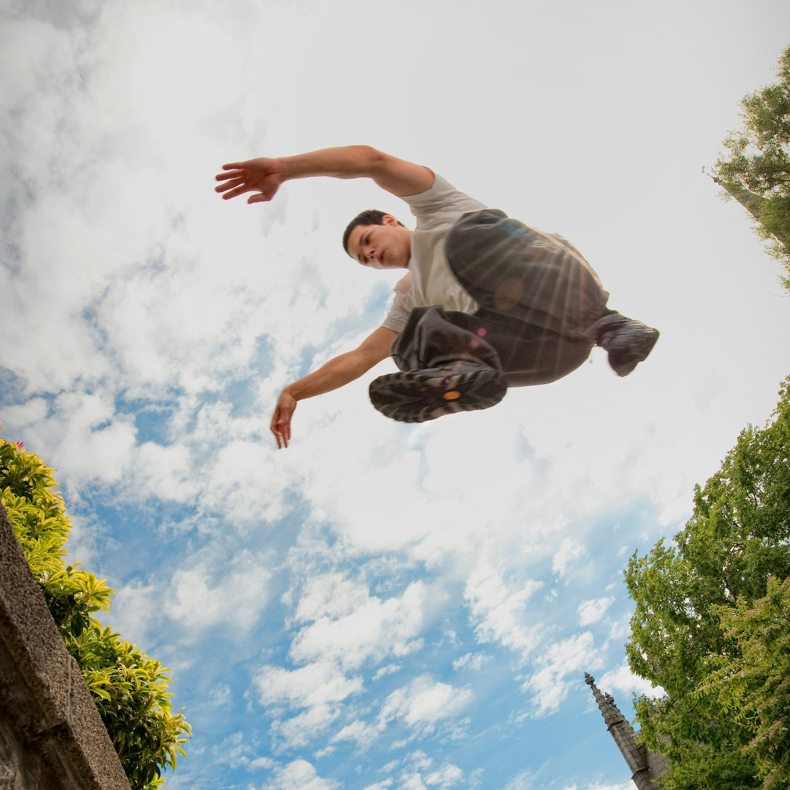

## Overview

| Role                         | Time           | Status  |
| ---------------------------- | -------------- | ------- |
| Founder and Community Leader | 2003 - Present | Passive |

## Description

In 2003, I discovered the art of parkour and became the first practitioner in Scotland. Recognising the potential of this exciting new discipline I took the initiative to establish Aberdeen Parkour - creating a strong, supportive community.

Originally, Aberdeen Parkour started off as Nokizaru - the moniker we gave our group of friends. Eventually this evolved into Aberdeen Parkour as the community grew and I sought to accelerate local involvement.

Over the years, this community has evolved and adapted to the digital age, migrating from IRC, websites and forums to social media platforms. As the founder and leader, I've been responsible for designing and managing multiple websites, community forums, groups and events. I've also organised thousands of meet-ups and training sessions, fostering a culture of support, camaraderie, and shared growth.

## Looking Forward

As I no longer live in Aberdeen I do not play an active role in the community and only occasionally help moderate.

My goals shifted to further promoting the sport within Scotland and beyond, to foster a culture that values health, fitness, and personal growth. Projects like [Ukemi](/projects/ukemi) and [MuvMentor](/projects/muvmentor) are a direct result of this.

## Links

- [Aberdeen Parkour on Facebook](https://www.facebook.com/groups/AberdeenParkour)
- [Aberdeen Parkour on YouTube](https://www.youtube.com/results?search_query=aberdeen+parkour)
- [aberdeen-parkour.co.uk on WayBackMachine](https://web.archive.org/details/http://www.aberdeen-parkour.co.uk/)
- [aberdeenparkour.co.uk on WayBackMachine](http://www.aberdeenparkour.co.uk/)
- [nokizaru.no-ip.com on WayBackMachine](https://web.archive.org/details/http://nokizaru.no-ip.com/)
- [nokizaru.tk on WayBackMachine](https://web.archive.org/details/http://www.nokizaru.tk/)
- [nokizaru.com on WayBackMachine](https://web.archive.org/details/https://www.nokizaru.com/)
