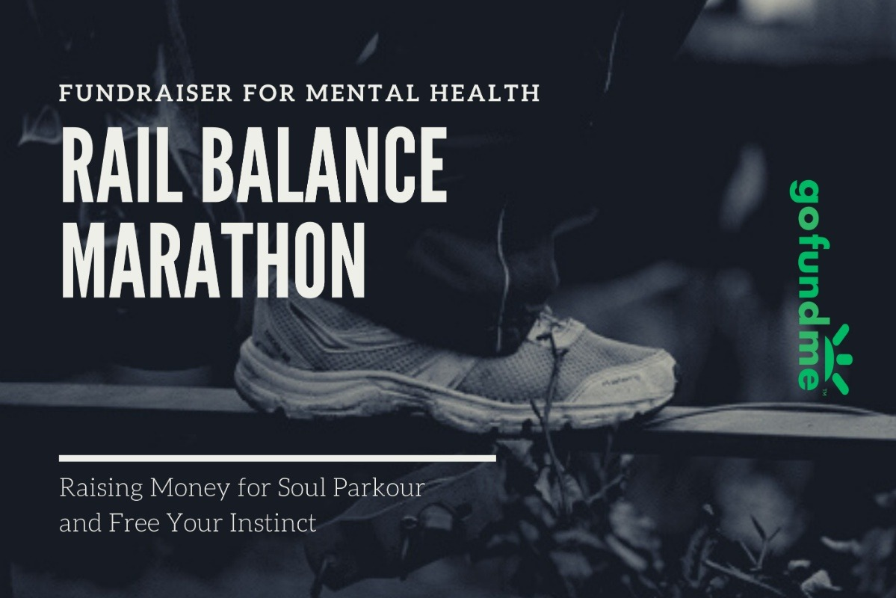
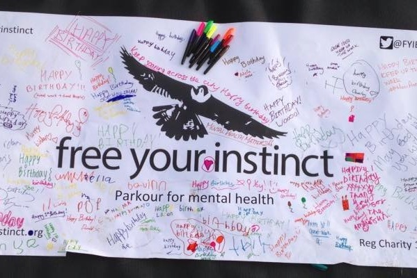

import { YouTube } from "astro-embed"

## Overview

| Role         | Time        | Status                                 |
| ------------ | ----------- | -------------------------------------- |
| Co-Organiser | 2020 - 2022 | Active - Handed over to new organisers |

## Description

The Balance Marathon is an annual community art project that aims to raise awareness around mental health, connect the global movement community and improve well-being through action.

The event began with the goal of David Banks (Ukemi) completing a marathon (26.2 miles / 42.2 kilometers) on a handrail. When an injury prevented the original attempt, we adapted the concept into a larger community event with a dual purpose: promoting mental health awareness and strengthening the global parkour community.

It is a call to action for the Parkour community worldwide to question the philosophy of "Être fort pour être utile" ("Being strong to be useful") and how we use this in our practice.

Each year [Ukemi](/projects/ukemi) runs the event alongside [Free Your Instinct](http://freeyourinstinct.org), a charity that uses parkour as a part of their mental health programs, and we select an additional international charity to support.

## Balance Marathon 2021

Between the 10th and 16th of May people from round the world came together tto raise money and awareness for mental health. Working together to balance the equivalent distance of the Nullarbor Straight - one of the longest straight roads in the world at 146.6km (91 miles).

The total distance donated was 334 kilometres with 228 participants!

We raised over £5000 to support mental health throughout parkour.
This has funded:

- 💥 2 months organisation costs for wallrunners
- 💥 2 x 12 week courses with FYI for at risk young people
- 💥 In addition to supporting the work at Soulparkour and Parkour Visions

<YouTube
  id="https://www.youtube.com/embed/1Tx0HnkW6ac"
  title="Balance Marathon 2 - Nullarbor Straight"
/>

## Balance Marathon 2020

- 💥 30+ participants from round the world
- 💥 £2,019 raised

<YouTube
  id="https://www.youtube.com/embed/X5yjO2cR59s"
  title="The Rail Marathon 2020"
/>

## Looking Forward:

As we continue to organise the Balance Marathon annually, our vision is to further expand its reach, increase participation, and raise more funds to support mental health programs.

We are also committed to reinforcing the philosophy of "Être fort pour être utile" within the parkour community, encouraging practitioners to leverage their strength for societal good.

## Links:

- https://www.instagram.com/balancemarathon/
- https://wallrunners.org/
- http://freeyourinstinct.org
- https://ensomovement.com/blog/one-mile-rail-balance-for-mental-health/
- https://www.parkouroutreach.com/new-blog/rail-balance-marathon-gordon-tsang
