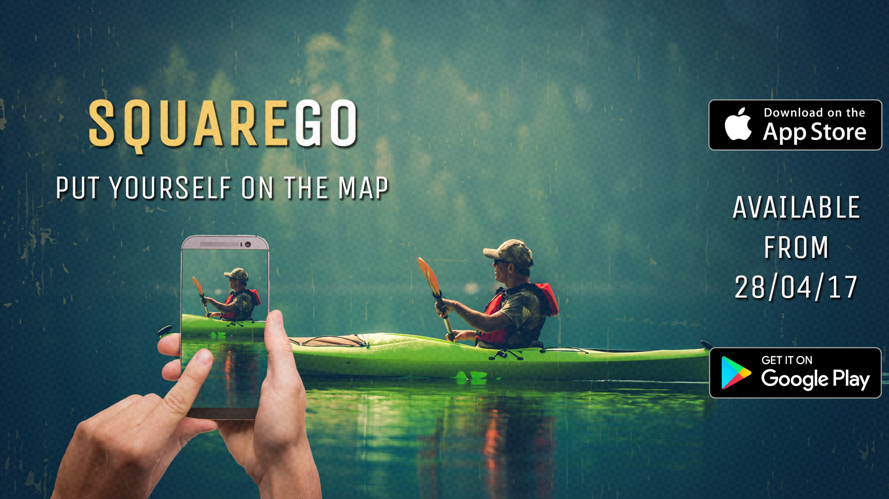

import app1 from "./images/app1.png"
import marketing from "./images/marketing-1.jpg"
import app2 from "./images/app2.png"
import app3 from "./images/app3.png"
import app4 from "./images/app3.jpg"
import logo from "./images/logo.jpg"

## Overview

| Role                             | Time        | Status   |
| -------------------------------- | ----------- | -------- |
| Co-Founder, Full-Stack Developer | 2017 - 2018 | Inactive |

## Technology

- **Architecture:** `Web`, `Mobile`, `Monolith`, `REST`, `MySQL`
- **Deployment:** `Docker`, `Azure`, `Android`, `iOS`
- **Language:** `IONIC`, `Typescript`, `Javascript`, `HTML`, `CSS`, `SQL`, `React.js`, `Stripe`

## Description

SquareGo was an ambitious project aimed at creating a mobile platform for sports, e-sports, tabletop games, and other activities. This location-based club and sports management app was developed as a payment system and organisational tool for events and competitions.

The app served as a comprehensive solution for amateur club, event, and class management, offering a platform for communication, fee handling, event discovery, result tracking, and secure in-app transactions.

We aimed to cater to a diverse range of interests, featuring over a thousand sports and activities, and facilitating the creation of unique sporting events.

My role in this entrepreneurial venture included developing the landing page with `React.js` and prototype app using `IONIC`, launching it on the `Play/Apple Stores`, creating media and marketing materials, and implementing `UI/UX` improvements in later versions of the app. I also performed market analyses, conducted focus group discussions, and developed a business plan.

  
  
  

## Accomplishments

- Co-founded and developed an innovative sports and activities management app, managing the launch on both the Play and Apple stores.
- Implemented significant UI/UX improvements in later versions of the app, enhancing user experience and functionality.
- Conducted comprehensive market analyses and gathered user feedback through focus groups to inform the development and business strategy.

  
  
  

## Looking Forward

Despite the fact that SquareGo didn't progress beyond the beta testing phase, the project served as an invaluable learning experience, providing significant insight into entrepreneurial ventures, mobile platform development, and the intersection of tech and sport.

It was an opportunity for substantial personal and professional growth, the lessons from which continue to inform my current and future projects.

## Links

- [SquareGo on Instagram](https://www.instagram.com/squaregoapp/)
- [SquareGo on WayBackMachine](https://web.archive.org/web/20180117182438/http://squarego.net/)
