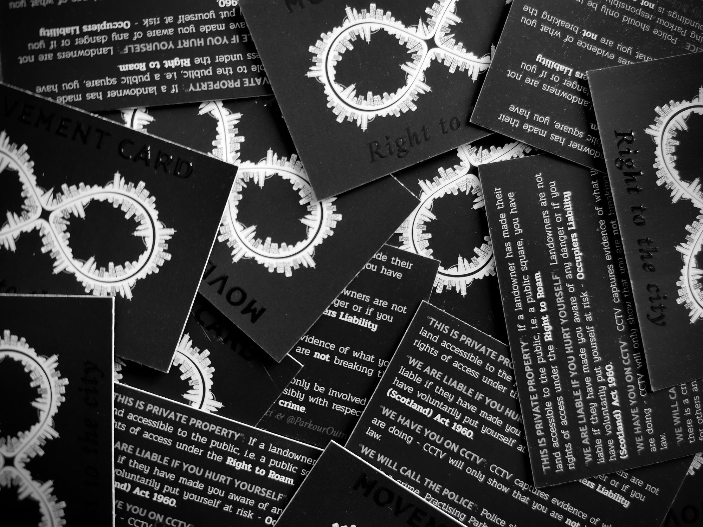

import muv from "./images/movement-card.jpg"
import muvrender from "./images/Movement-Card-Render-Both-Sides.jpg"

## Overview

| Role                              | Time           | Status | Source | Website        |
| --------------------------------- | -------------- | ------ | ------ | -------------- |
| Co-Organiser, Designer, Developer | 2020 - Present | Active | GitHub | mvmnt-card.com |

## Description

The Movement Card is a global initiative I co-created in collaboration between [Ukemi](/projects/ukemi) and [Parkour Outreach](https://www.parkouroutreach.com/). This project is part resource, part research, and part response action, with a mission to promote freedom of movement worldwide.

The objective is to create a card for every country in the world. These cards are designed to help people engage in urban space activities and draw comparisons on the rights of each nation, laying a foundation for action.

We encourage anyone to get involved in the project. If you are interested in contributing, please get in touch!

  
  

## Contributions

- **Product Design:** Led the design of the Movement Card, a physical product aimed at educating the public and advocating for freedom of movement.

- **Web Development:** Built a static website using `Hugo` and `Bootstrap` to accompany the physical product, providing a platform for users to engage with the initiative.

- **Cloud Deployment:** Managed the deployment of the website on `AWS`, utilizing `S3`, `CloudFront`, and `CodeBuild/Pipeline` to ensure smooth operations and delivery.

## Looking Forward

As I continue to work on The Movement Card project, my goal is to extend its reach to more countries and to refine the product and website based on user feedback and changing needs.

I aim to further leverage this platform as a tool for education, advocacy, and action in the promotion of freedom of movement.

## Links

- [Movement Card Website](https://mvmnt-card.com)
- [Source Code](https://github.com/ukemi-project/mvmnt-card.com)
- [Ukemi Blog](https://ukemi.ninja/blog/movement-card-right-to-the-city)
