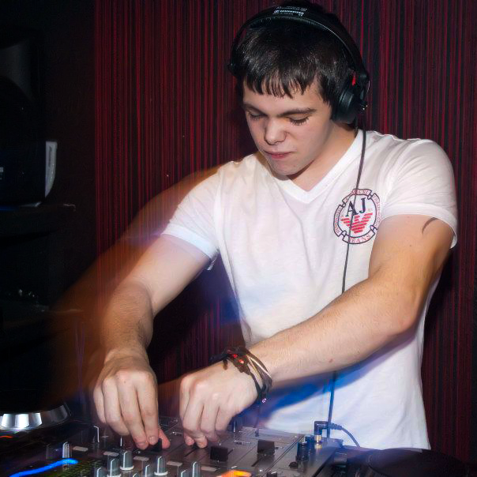
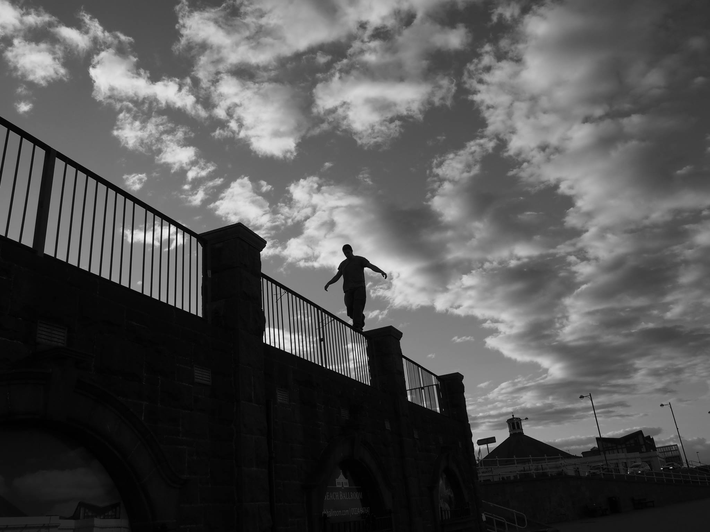
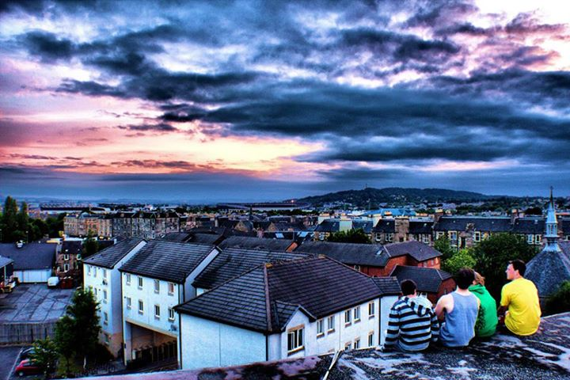
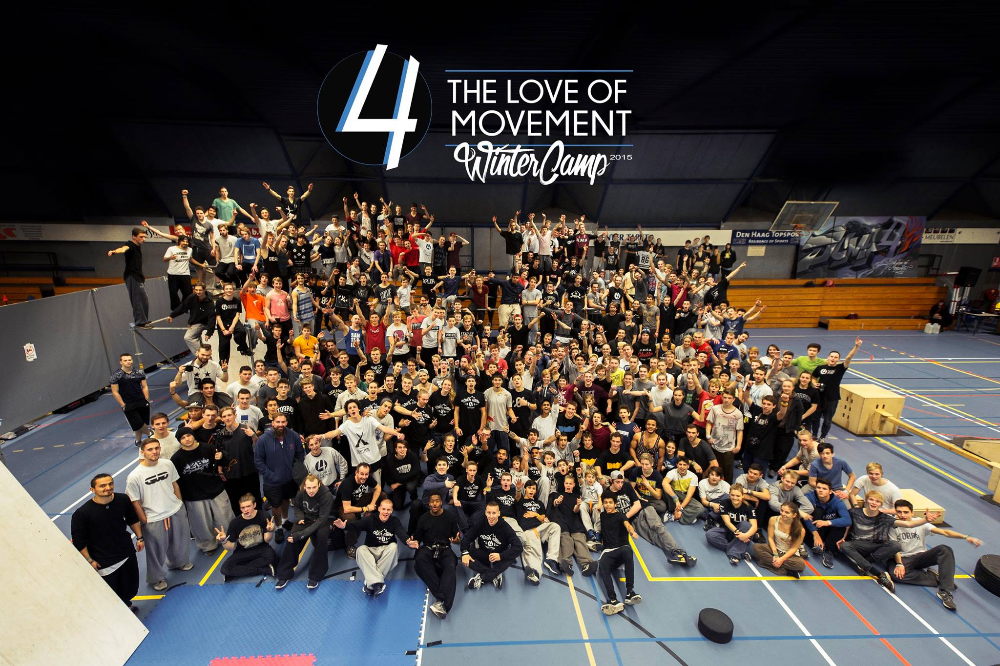

Welcome, I'm Dan <small><em>(He/Him)</em></small>.

### TLDR

- I work as the _Engineering Team Lead_ at [Push](https://pushentertainment.com/).
- I'm a founder of [Aberdeen Parkour](/projects/aberdeen-parkour), [SquareGo](/projects/squarego), [Ukemi](/projects/ukemi), and [MoveMentor](/projects/movementor).
- I've been building things since 2002 and I'm passionate about Software Architecture, System Design, Cybersecurity, and People.
- I make Drum & Bass [music](https://linktr.ee/omuxdnb).
- Read what I'm up to [now](/now).
- Discover the tools I [use](/uses).

## Longer version

### Introduction

Introductions are hard, so my intention for this page is not to replicate my resume, but to introduce myself as a human — hopeful, resilient, and flawed.

The stories we tell ourselves hold a lot of power; they construct our identity, shape our ethics, and plot our destiny. Thus, my preference for personal labels leans towards broader nouns that elucidate a combination of what I am, and what I aspire to be.

With that in mind, some labels I currently adopt are: Problem Solver; Learner; Creator; Producer; Leader; and Mover.

### Origin Story

My exposure to tech began when my uncle gifted us an old PC running [Windows 3.1](https://en.wikipedia.org/wiki/Windows_3.1). It came with games like [Heretic](https://www.retrogames.cz/play_496-DOS.php), [Doom](https://www.retrogames.cz/play_414-DOS.php), and [Commander Keen](https://www.retrogames.cz/play_471-DOS.php). I was around 10 years old, and we had no instructions, no internet, and no choice but to learn how to use a somewhat unintuitive combination of GUI and DOS.

Three years later, I got my first computer as a birthday gift, a big off-white HP tower, Windows XP, and a 56 kbps internet connection. It's difficult to articulate the sense of wonder and freedom I felt as an unsupervised teenager, emboldened by anonymity, with an entirely new world at my fingertips. Every day I'd discover new websites, obscure documents, and things to learn.

Though I am grateful for much, my childhood is not one I'd characterise as stable. At thirteen, I was living with my mother, a single parent with rapidly advancing [Multiple Sclerosis](https://en.wikipedia.org/wiki/Multiple_sclerosis). The computer I'd been given was not just a toy, but an opportunity with limitless potential and a gateway for escapism — both of which I pursued relentlessly.

I quickly found myself immersed in obscure communities, speaking with people multiple times my age on [IRC](https://en.wikipedia.org/wiki/IRC) and [DC++](https://en.wikipedia.org/wiki/DC%2B%2B). I'd stay awake until 5am reading text files on programming, network protocols, black hat e-zines, and studying exploits on [Millw0rm](https://github.com/KyteProject/mirror-milw0rm). There was nothing I didn't want to learn, and the allure of the early 2000s internet counterculture was entirely irresistible.

### The Parkour Arc

In 2003, a friend shared a [video](https://www.youtube.com/watch?v=OaVzjGOqQQY) on MSN. It contained a group of men running, jumping, and flipping in the urban jungle of Lisses, France. Immediately inspired, we went outside to try it ourselves. Later that year, a BBC documentary called [Jump London](https://en.wikipedia.org/wiki/Jump_London) aired in the UK, and it solidified our passion for the sport.

The discovery of [parkour](https://en.wikipedia.org/wiki/Parkour) ([L'Art du Déplacement](https://www.parkourways.com/history)) was another pivotal moment in my life. I was obsessed. For the next fifteen years, whenever I wasn't scouring the internet, I was practising parkour. We would train every day after school, and up to twelve hours at the weekend!

It's an unforgettable experience to be involved in the inception of a new discipline. There were no experts to consult, no community to learn from, and no rules.

On the outside, parkour appeared to be just urban gymnastics, but to those inside the community, it was intrinsically linked to an almost spiritual philosophy of “movement.” In this regard, it was far closer to Eastern martial arts than any other sport.

In our minds, We weren't just reclaiming public spaces; we were dismantling social constructs and shaping a collective morality — all stemming from the mantra: “Être fort pour être utile” (“Being strong to be useful”).

As a result of my combined interests, and serendipitous placement at the birth of parkour, I quickly began building websites and forums, doing everything I could to foster the community in Scotland. Establishing a new culture, discovering new movements, and living through its transition into a global phenomenon.

Throughout the years, I've met, trained with, and helped bring hundreds of new people into the sport. It's something I am deeply proud of, as parkour transforms lives in ways no other sport can.

My closest friends today were strangers I met online 20 years ago. I can honestly say that parkour and the people I've met along the way have had a profoundly positive impact on my life.

### Now

Drawing inspiration from the [Now](https://nownownow.com/about) page movement, I've created a dedicated place for communicating my recent endeavours. You can view it [here](/now).

### Closing Thoughts

I've been building websites, exploring networking, cybersecurity, and operating systems for over 20 years now. That journey has taught me that I'm bored when not challenged, I'm motivated by interesting problems, and I “wearing multiple hats”.

If you'd like to connect, please feel free to reach out via email or social media. I'd be happy to chat about anything!
